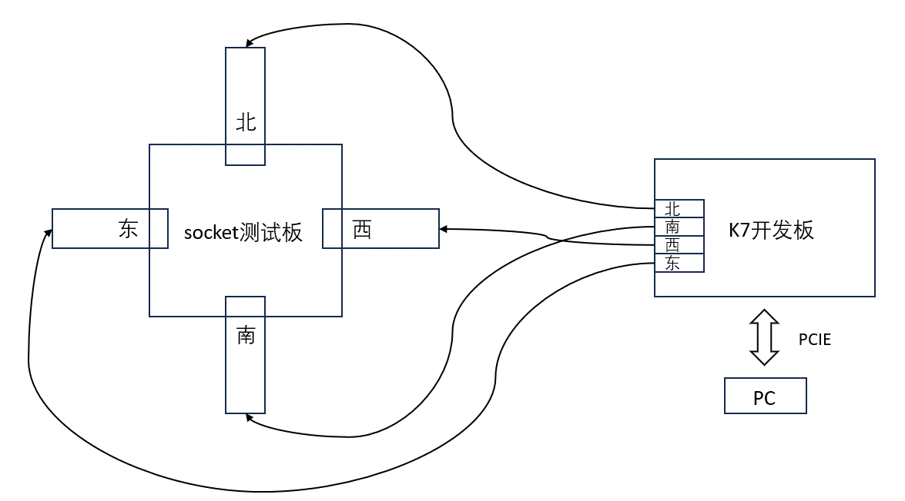
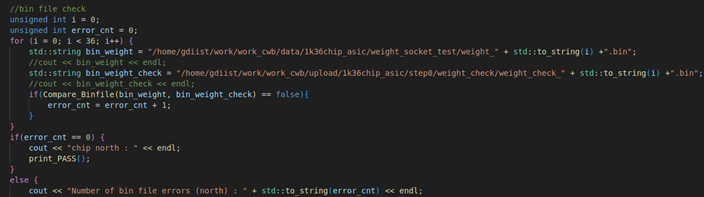

    

brain-inspired chip test system for gdiist
===========================

**（1）硬件部分**

* 1 * 米联客K7开发板
* 4 * fpga光口子板
* 1 * socket测试板
* 1 * 12v电源线 
* 4 * 光纤线

**（2）软件部分**

* 环境：系统Ubuntu 20.04，VSCODE，VIVADO
* XDMA驱动
* sh文件
* 上位机程序文件：work_cwb/run_socket_eswn/
* 下载数据weight文件路径：work_cwb/data/1k36chip_asic/weight_socket_test/（最大不超过64K）
* 上传数据weight_check文件路径：work_cwb/upload/1k36chip_asic/step0/
* 比特流文件：pice_socket为K7开发板，socket_north/west/south/east对应北西南东四个方向的板卡，均有bit，ltx文件可用于编程调试，以及对应的bin文件可用于固化

PS：确认上位机程序的launch.json中的下载和上传路径设置正确

**（3）测试步骤**

1、确保硬件连接正确，确认文件路径正确 

2、检查PCIE连接，加载load.sh

3、先将芯片放入socket中，旋转socket至压紧，给socket测试板上电

4、按一下北方向板卡的复位按钮（重新下发router_setup指令），之后运行上位机程序

    ——终端出现ALL PASS则代表芯片测试通过；

    ——终端出现FAIL则代表芯片测试失败，并会打印出错误的方向和错误的bin文件及个数； 

    ——上位机卡住，显示prepare to upload test说明没有返回时钟；

5、测试下一个芯片，先将socket测试板断电后在执行步骤3，步骤4；

PS：出现FAIL则表示该方向可以读写数据，但上传数据不正确；

	出现上位机卡在prepare to upload test则表示数据没有上传或时钟没有返回；

PS：若出现FAIL，有以下方法可以尝试

    （A）复位西方子板，再进行步骤4；

    （B）复位四个方向的子板，再进行步骤4；

    （C）复位K7开发板，加载load.sh，再进行步骤4；

    （D）关电，重新放置芯片，再次上电后进行步骤4；

    若上位机卡住，有以下方法可以尝试

    （A）复位西方子板，再进行步骤4；

    （B）复位四个方向的子板，再进行步骤4；

    （C）复位K7开发板，加载load.sh，再进行步骤4；

**（4）测试失败可能的原因**

1、芯片故障

    ——如果卡在prepare to upload test则可能芯片某一通道无返回时钟

    ——如果对比bin文件错误为芯片输出数据错误

2、芯片与socket接触不良

3、系统未复位成功

**（5）上位机工程**

main函数部分：

通过写DIRECTION_SEL寄存器来切换北西南东方向进行测试；（FPGA中通过寄存器选择光口输出）；

其中Data_Test是测北方，Data_Test_West测西方，Data_Test_South测南方，Data_Test_East测东方；

输出ALL PASS则代表芯片四个方向读写正常；

Data_Test函数部分（同Data_Test_West/South/East）：

下发remote_setup，下载数据，上传数据（上传最大64*1024）；

其中remote/download/upload函数新增chip_direction_sel参数，用于切换不同方向的包头和坐标；

//bin file check部分为检测上传的weight_check.bin文件是否与下载weight.bin一致，通过Compare_Binfile函数对比，若正常则通过输出PASS进行下一个方向测试，若出现错误则会打印FAIL和错误的bin文件以及错误个数，并结束程序运行；

**（6）FPGA工程**
K7开发板工程：

PS：direction_sel寄存器的低16位控制数据走向，选择对应一路SFP接口输出
| direction_sel [15:0] |      mode      | 
| :------------------: | :------------: | 
|       16‘h0001       |     North      |
|       16‘h0010       |     South      |
|       16‘h0100       |     West       | 
|       16‘h1000       |     East       | 

光口子板工程：test mode 0，给芯片100Mhz，芯片给出20Mhz

PS：北方向的工程中会多一部分计数器模块，来驱动类脑芯片功能引脚如die0_refclk，die0_rst_n, die0_pin_test；register模块会多一个发送router_setup指令的功能；其余南西东方向工程一致，仅约束文件不同。

